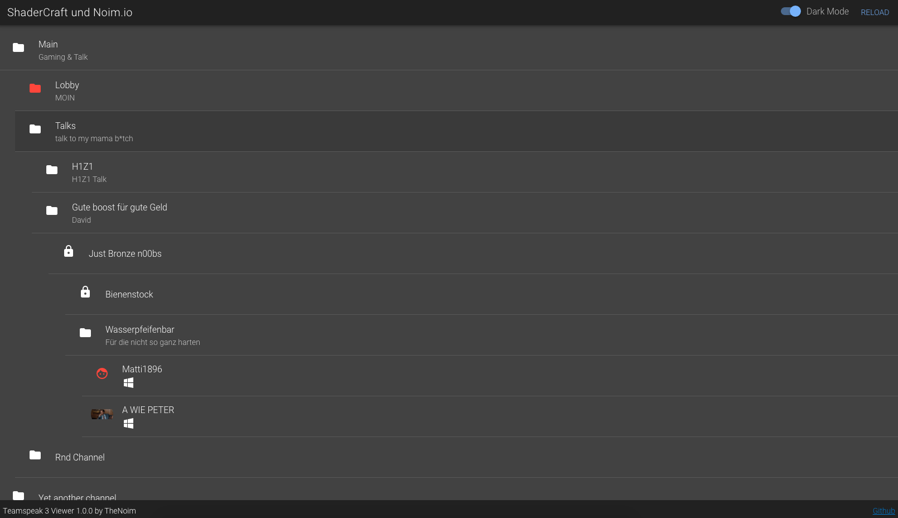

# Teamspeak 3 Viewer

[](https://travis-ci.org/TheNoim/ts3viewer)



### Current features
- Material design teamspeak web viewer
- Live view (Real time)
- Caching
- Basic http api
- Telegram bot
- Docker support
- RSS Feed
- Dark and light mode
- Bad documentation (not a feature but a warning)

### Current api endpoints (Everything GET and returns JSON except RSS Feed)
##### Avatar & icon related
`/avatar/:type/:id`  
Possible types: `dbid` or `uid`  
`/icon/:id`  
##### Channel Tree
`/channelTree`  
The channel tree as json 
##### User related
`/online`  
Get the current online users  
`/user/:type/:id`  
Possible types: `dbid` or `uid`  
`/users`  
Every user in the database
##### RSS Feed
`/feed`  
The xml rss feed. Contains join and left history.

### Docker
[Docker Repository](https://hub.docker.com/r/3003/tsviewer/)

### Requirements
- NodeJS
- yarn or npm (If npm, replace all yarn commands below with npm)
- MongoDB

### Use
```bash
yarn install
yarn dockerstartup
```

### Development
1. `yarn watch` Watches for file changes and updates the public directory
2. `yarn start` Starts the fastify server

### Supported settings
You need to use env variables.

##### List of env variables:
| Variable         | Description                        | Default                         | Example                          |
|------------------|------------------------------------|---------------------------------|----------------------------------|
|TSVSERVERIP       | Teamspeak server ip/host           | `127.0.0.1`                     | `myserver.com`                   |
|TSVSERVERPORT     | Teamspeak server query port        | `10011`                         | `10011`                          |
|TSVSERVERUSERNAME | Teamspeak query admin username     | `serveradmin`                   | `serveradmin`                    |
|TSVSERVERPASSWORD | Teamspeak query admin password     |                                 | `mypassword`                     |
|TSVSERVER         | Teamspeak virtual server id        | `1`                             | `1`                              |
|TSVMONGO          | MongoDB address                    | `mongodb://localhost/teamspeak` | `mongodb://172.17.0.6/teamspeak` |
|TSVCACHE          | Cache time in ms                   | `120000`                        | `2000`                           |
|TSVPORT           | Webserver port                     | `5000`                          | `8080`                           |
|TSVHOST           | Webserver host                     | `0.0.0.0`                       | `127.0.0.1`                      |
|TSVDARKMODE       | UI dark mode default               | `false`                         | `true`                           |
|TSVBBCODE         | BBCode enabled (WIP)               | `false `                        | `true`                           |
|TSVTITLE          | Title (HTML supported)             | Teamspeak 3 Viewer              | My Teamspeak                     |
|TSVFOOTERTEXT     | Right footer Text (HTML supported) |                                 | © 2017                           |
|TSPOLLINGTIME     | The time between each refresh (ms) | `500`                           | `1000`                           |
|FEEDURL           | The feed url                       | Nothing (Required for feed)     | https://mydomain.com/feed        |
|FEEDSITEURL       | You need to specify a website      | Nothing (Required for feed)     | https://mydomain.com             |
|FEEDTITLE         | The title of your feed             | Nothing (Required for feed)     | User feed                        |
|TELEGRAMTOKEN     | The telegram bot token             | Nothing (Required for bot)      | Your token                       |
|TELEGRAMBASEURL   | The url to the ts viewer           | Nothing (Required for bot)      | https://mydomain.com/            |
|TELEGRAMPOLLING   | Force polling                      | `false`                         | `true`                           |

